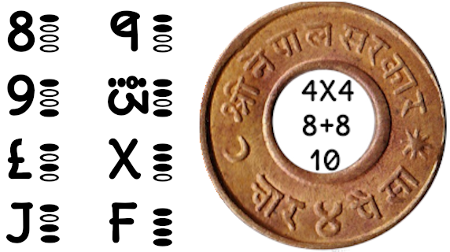

## steps for hao to install and use plong lib in place of float/double in c++ programs :

1. cd install
2. run install script as : ./install_plong.sh (if not permitted then run : chmod 755 install.sh)

```
~/maigit/eclp/plong/install $ ./install_plong.sh
installing cplong library.
copying libplong.so in /usr/lib/ directory. may need your sudo permission
copying cplong.h in /usr/include/ directory. may need your sudo permission
finished installing.  to use library, add '-lplong' as a flag
```

1. if install.sh ran successfully then in c++ programs ve can use cplong as
	
	```
	1. in our programs(say sample.cpp) ve need to include cplong as : #include <cplong.h>
	
	2. when compile program using g++ ve need to use -lplong at end as:	
	
	3.g++ -c sample.cpp -lplong
	
	4. for sample usage ve can see test programs vritten in tests folder.
	'''

2. to run testcases for this lib
	
	```
	
	1. go to plong/tests directory
	
	2. ~/plong/tests $ ./run
	
	```


# vhy to use plong library instead of float/double :


## [repl.it clang build command](https://replit.com/@zava8/plong) :
clang++-7 -pthread -std=c++17 -o main src/cplongekseption.cpp src/cplong.cpp src/main.cpp

## linux g++/clang++ build command :
1. ~/maigit/eclp/plong $ **clang++ -o main src/cplongekseption.cpp src/cplong.cpp src/main.cpp**
2. ~/maigit/eclp/plong $ **g++ -o main src/cplongekseption.cpp src/cplong.cpp src/main.cpp**

####computing in 1 boat ( alu only ) :
1. [c8 vith plong library](https://github.com/zava8/plong)
2. [discuss n code phur c8](https://replit.com/@zava8/plong)

####india oriznl nmbr system :
1. heksadesiml(123456789LJQWXF 10=8+8=4*4)
2. precision layers : rupaiya(0th pl) , aana(-1th pl) ....

####historical instances oph india oriznl nmbr system :
[pach rupaiye barah aana](youtube.com/watch?v=wO5qkv6Fabg)

= pach rupaiye + barah aana

= (5, 0) + (Q, -1)

= (5, 0).dec_pl(-1) + (Q, -1)

= (50, -1) + (Q, -1)

= (50+Q , -1)

= (5Q, -1)

= 5Q:1 string representation 1 here means 1 layer belo 0th precision layer.





